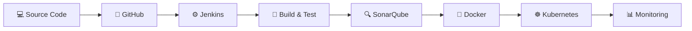

# 👋 Hi, I'm Arul Kumar V

 

---

## 👨‍💻 Professional Summary

Cloud and DevOps Engineer with strong hands-on knowledge of AWS cloud infrastructure, Linux administration, networking, CI/CD automation, containerization, Infrastructure as Code and monitoring. Experienced in implementing AWS architectures, Jenkins pipelines, Docker containers, Kubernetes deployments, Terraform infrastructure and Ansible automation through practical projects.

- ☁️ Proficient in AWS compute, storage, networking, database, security and monitoring services
- 🌐 Strong knowledge of networking, subnetting, routing, DNS and AWS VPC architecture
- 🔄 Hands-on experience implementing Jenkins CI/CD pipelines
- 🐳 Experienced in Docker containerization and Kubernetes orchestration
- 🏗️ Infrastructure automation using Terraform and Ansible
- 🐧 Linux server administration, Bash scripting and troubleshooting
- 📊 Monitoring and logging using CloudWatch, Prometheus, Grafana and ELK
- 🎓 B.E. Electronics and Communication Engineering graduate – 2023
- 📍 Chennai, India
- 💼 Available for Cloud Engineer, AWS Engineer and DevOps Engineer interviews

---

## 🧰 Technology Stack

 

---

## ☁️ AWS Cloud

| AWS Category | Technologies |
|---|---|
| **Compute** | EC2, AMI, Auto Scaling, Elastic IP, User Data, Lambda |
| **Networking** | VPC, Subnets, Route Tables, IGW, NAT Gateway, Elastic Network Interfaces |
| **Load Balancing** | Application Load Balancer, Network Load Balancer, Target Groups, Health Checks |
| **Storage** | S3, EBS, EFS, S3 Versioning, Lifecycle Policies |
| **Database** | RDS MySQL, Multi-AZ, Read Replicas, DynamoDB |
| **DNS and CDN** | Route 53, CloudFront, ACM |
| **Containers** | ECR, ECS, EKS, Fargate |
| **Security** | IAM, Security Groups, NACL, KMS, Secrets Manager |
| **Monitoring** | CloudWatch, CloudTrail, VPC Flow Logs |
| **Connectivity** | VPC Peering, Transit Gateway, VPC Endpoints, VPN |

---

## 🌐 Networking

- OSI Model and TCP/IP Model
- IPv4, IPv6, public IP and private IP
- CIDR notation and subnetting
- TCP, UDP, HTTP, HTTPS and SSH
- DNS, DHCP, ARP and ICMP
- Routing, switching and gateways
- NAT, firewalls, VPN and proxy servers
- Load balancing and reverse proxy
- SSL/TLS certificates
- Public and private network architecture
- AWS VPC, route tables and subnet routing
- Security Groups and Network ACL
- VPC Peering and Transit Gateway
- VPC Endpoints and private connectivity
- Route 53 routing policies and health checks
- Linux network troubleshooting commands

---

## ♾️ CI/CD and Software Delivery

- Git and GitHub version-control workflow
- Branching, merging and pull requests
- Jenkins installation and administration
- Declarative and scripted Jenkins pipelines
- Pipeline as Code using `Jenkinsfile`
- GitHub webhook integration
- Maven build, test and package lifecycle
- SonarQube code-quality analysis
- Docker image build through Jenkins
- CI/CD credentials management
- Multibranch pipelines
- Build artifacts and pipeline logs
- Automated deployment workflow
- Deployment validation and health checks
- GitHub Actions workflow configuration

---

## 🐳 Docker and Kubernetes

| Docker | Kubernetes |
|---|---|
| Docker images and containers | Pods and ReplicaSets |
| Dockerfile | Deployments |
| Multi-stage builds | Services |
| Docker Compose | ConfigMaps and Secrets |
| Docker volumes | Namespaces |
| Container networking | Ingress |
| Port mapping | Persistent Volumes |
| Docker Hub and ECR | Horizontal Pod Autoscaler |
| Container troubleshooting | Rolling updates |
| Image optimization | Deployment rollback |
| Container logs | Kubernetes health probes |
| NGINX containers | Helm charts |

---

## 🏗️ Terraform and Ansible

### Terraform

- Terraform providers and resources
- Input variables, local values and outputs
- Resource dependencies
- Terraform state management
- Remote backend and state locking
- Terraform modules
- Terraform workspaces
- AWS VPC and EC2 provisioning
- Security group automation
- EC2 User Data configuration
- `terraform init`, `validate`, `plan`, `apply` and `destroy`

### Ansible

- Ansible inventory and host groups
- Ad-hoc commands
- Playbooks and tasks
- Variables and facts
- Templates and handlers
- Ansible roles
- Package installation
- Service management
- File and permission management
- Linux server configuration
- SSH-based remote administration

---

## 🐧 Linux and Shell Scripting

- Linux filesystem and directory structure
- Users, groups, permissions and ownership
- Process and service management
- `systemctl` and `journalctl`
- Package management
- Disk, memory and CPU monitoring
- SSH and SCP
- Cron job scheduling
- Bash scripting
- Environment variables
- Log analysis and troubleshooting
- Linux networking commands
- NGINX and Apache administration
- File and text-processing commands

---

## 📊 Monitoring and Logging

- Infrastructure and application metrics
- Prometheus server and exporters
- Grafana dashboards
- CloudWatch metrics, logs and alarms
- Centralized logging using ELK
- CPU, memory, disk and network monitoring
- Application and system log analysis
- Health checks and availability monitoring
- Alert configuration
- Service and infrastructure troubleshooting

---

## 🔄 DevOps Workflow

---

## 🚀 Featured Projects

<table>
<tr>
<td width="50%" valign="top">

### ♾️ DevOps Realtime Projects

Production-style DevOps projects covering CI/CD, containerization, orchestration, Infrastructure as Code and monitoring.

**Technologies**

`Jenkins` `Docker` `Kubernetes` `Terraform` `Ansible`

</td>
<td width="50%" valign="top">

### 🚀 AWS Projects

Hands-on AWS projects implementing secure, scalable and highly available cloud architectures.

**Technologies**

`AWS` `VPC` `EC2` `ALB` `RDS` `CloudFront`

</td>
</tr>

<tr>
<td width="50%" valign="top">

### ☁️ AWS Cloud Computing

Structured AWS learning repository covering core services, architecture, security, networking and monitoring.

**Technologies**

`AWS` `EC2` `S3` `IAM` `VPC` `RDS`

</td>
<td width="50%" valign="top">

### 🐧 Linux for DevOps

Linux administration and troubleshooting reference designed for Cloud and DevOps engineering workflows.

**Technologies**

`Linux` `Ubuntu` `Bash` `SSH` `systemd`

</td>
</tr>

<tr>
<td width="50%" valign="top">

### 🏗️ Terraform AWS

Reusable Infrastructure as Code configurations for provisioning and managing AWS resources with Terraform.

**Technologies**

`Terraform` `AWS` `VPC` `EC2` `Remote State`

</td>
<td width="50%" valign="top">

### ⚙️ Ansible Automation

Ansible automation for Linux configuration management, application deployment and repeatable server operations.

**Technologies**

`Ansible` `Linux` `YAML` `Roles` `Playbooks`

</td>
</tr>
</table>

---

## 🛠️ Hands-On Implementations

- ☁️ Implemented AWS multi-tier architecture using VPC, EC2, ALB and RDS
- 🌐 Configured public and private subnets, routing, NAT Gateway and security rules
- 🔄 Implemented Jenkins pipelines using Maven, SonarQube and Docker
- 🏗️ Provisioned AWS resources using Terraform
- ⚙️ Automated Linux server configuration using Ansible
- 🐳 Containerized web and Java applications using Docker
- ☸️ Deployed containerized applications using Kubernetes objects
- 📊 Configured monitoring concepts using CloudWatch, Prometheus and Grafana
- 🌍 Hosted static websites using S3, CloudFront, Route 53 and ACM
- 🗄️ Configured MySQL database connectivity using Amazon RDS

---

## 📈 GitHub Statistics

 

 

---

## 📊 Contribution Activity

---

## 🎯 Career Objective

To contribute as a Cloud or DevOps Engineer by applying my knowledge of AWS infrastructure, Linux administration, networking, CI/CD pipelines, Docker, Kubernetes, Terraform, Ansible and monitoring. I am prepared to support automated software delivery, reliable cloud infrastructure and production troubleshooting.

---

## 🤝 Connect With Me

### Available for Cloud and DevOps Interviews

📍 **Chennai, India**

💼 **Cloud Engineer · AWS Engineer · DevOps Engineer**

---

### ⚡ Design · Automate · Deploy · Monitor · Improve

